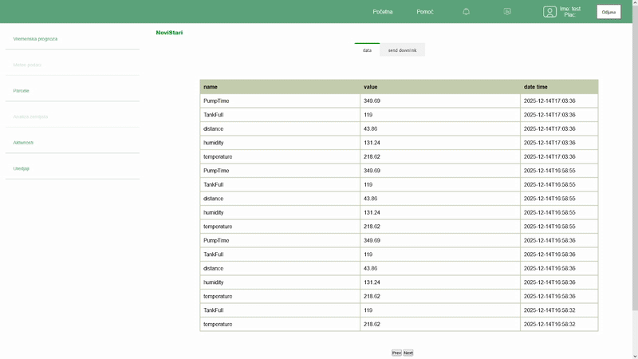

### Web application for menagement of agricultural production. 

Application is fully reactive and 
has two main features: \
1. Inventory app for individual agriculturalists for keeping complete account of plant production from the fields of \
arable and vegetable farming.
2. Interface with LoraWAN device trough integration with LoraWAN network servers (The Things Network and Chirpstack v1).\

  ###  1. Inventory app

After user is logged into the account, he is located on the page for creation and choosing of fields. \
After field is choosen it is possible to add activies that are done on that field. \
Actvities pages offer CRUD capabilites. It features dynamic formulars that are equivalent to the ones that \
are needed for "Knjiga polja"[1]. \

### 2. Inteface with LoraWAN device

Application provides ability to send and receive data from LoraWAN devices. 

##### 2.1 The Things Network

Open The Things Network console 
Create and copy API key,
Copy your End_Device_ID,

Create new custom Webhook,
set: 
Downlink Api key to the created Api key
Webhook format to JSON
Base Url to AgoTek's base url + /api/TTN
Enable event types: Uplink message, Downlink que invalidated, Service data.

Go back to the AgoTek App, in "Uredjaji" section choose "Dodaju uredjaj" Choose TTN integration.
Past the End_Device_ID and API key and name your device.

##### 2.2

refrences: 
[1] https://www.psss.rs/wp-content/uploads/2021/10/knjiga.polja_.pdf   "Knjiga polja" (Field books)
is meant for individual agriculturalists for keeping complete account of plant production from the fields of \
arable and vegetable farming. Similar requirement are need for satisfying the needs of laws for food safty \
and for certifications for products e.g. (GLOBALG.A.P standard)

